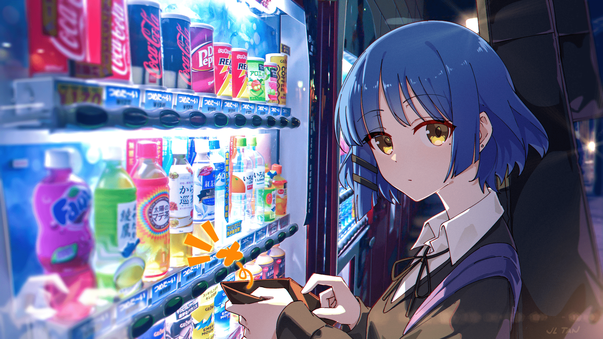

# qu1r0ra 🤗

Hi, I'm CJ. I like Herta from Honkai: Star Rail, Alice from Genshin Impact, and Gold Ship from Umamusume: Pretty Derby.

TL;DR: **I love HAGS**.

Machine learning enthusiast who likes to lift and learn stuff in his free time.

    

## Some workspace essentials

    <a href="https://skillicons.dev/">
        
         
        
    </a>

## I've dabbled with these and still occasionally do

    <a href="https://skillicons.dev/">
        
         
        
         
        
         
        
         
        
         
        
    </a>

## Besides hags, I like plastering things with Ryo

